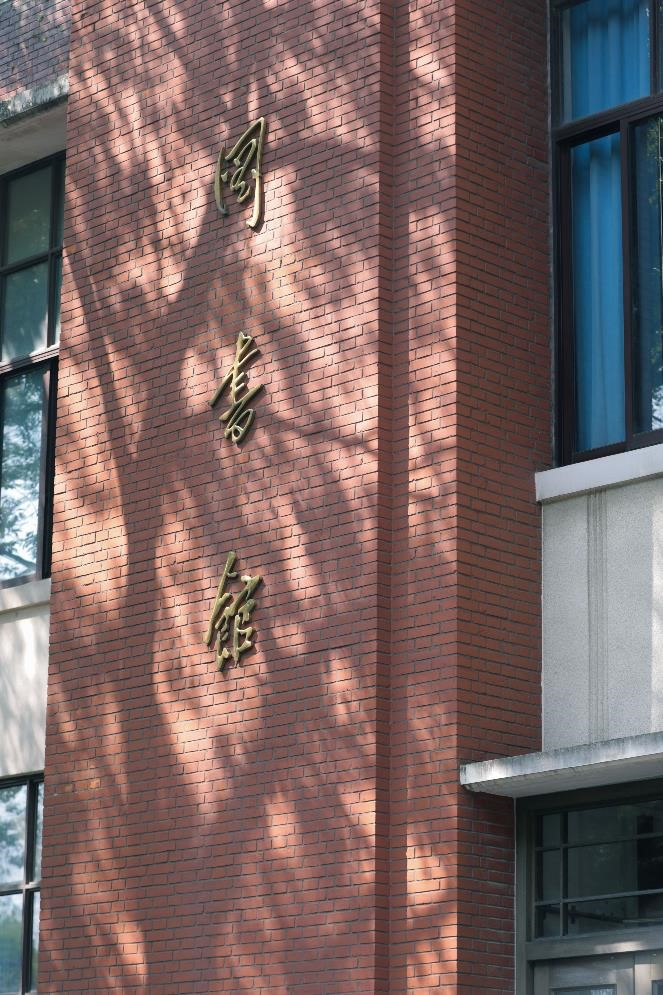

<!--
_paginate: false
-->

 
 
 
 

## 汇报题目 h1样式
### 副标题 h2样式
**openFudan  2023-03-29**

---

<!--
_paginate: false 
-->

# 目 录

###### 1 
###### 2 
###### 3 
###### 4
###### 5 
###### 6 
###### 7
###### 8 

---

<!--
_paginate: false 
-->

# 目 录

###### 1 
###### 2 
###### 3 
###### 4 
###### 5 
###### 6 
###### 7 
###### 8 

---
<!-- _header: 1 -->
<!--
_paginate: false 
-->

---
<!-- _header: 2 -->
<!--
_paginate: false 
-->

---
<!--_header: 3 -->
<!--
_paginate: false 
-->

---
<!--_header: 4 -->
<!--
_paginate: false 
-->

---
<!--_header: 5 -->
<!--
_paginate: false 
-->

---
<!--_header: 6 -->
<!--
_paginate: false 
-->

---
<!--_header: 7 -->
<!--
_paginate: false 
-->

---

<!--_header: 8 -->
<!--
_paginate: false 
-->

---
<!--_header: 参考 -->
<!--
_paginate: false 
-->

## 

---

<!--
_paginate: false 
-->

 
 
 

# 请各位老师批评指正
**openFudan  2023-03-29**