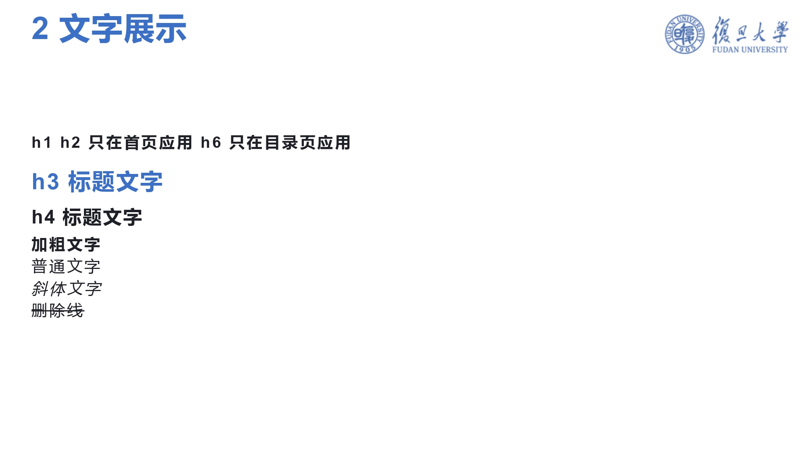
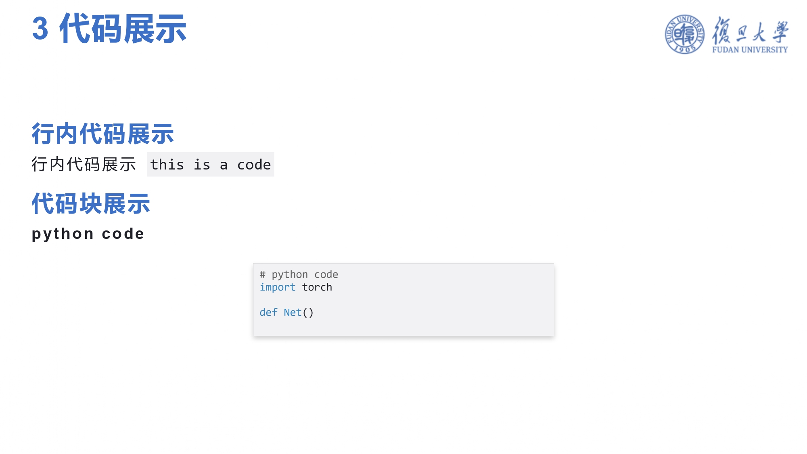
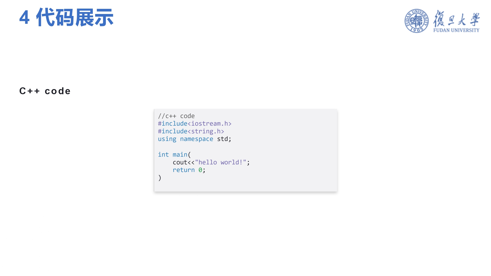
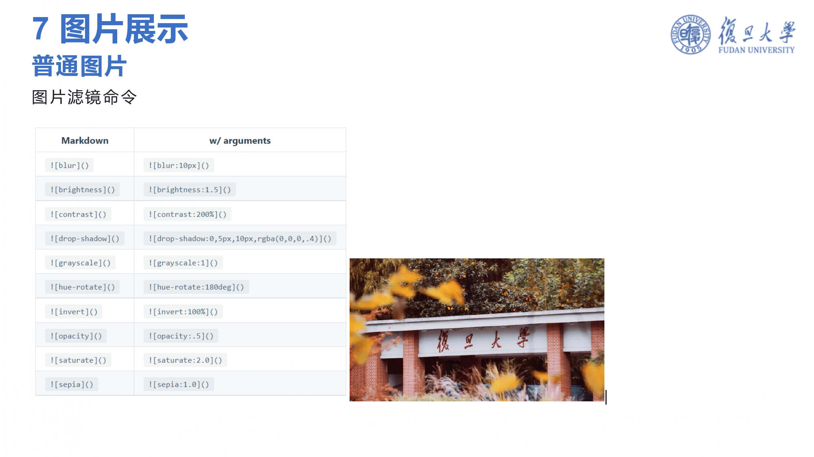
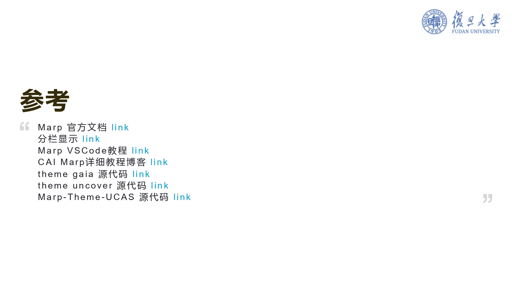

# Marp-Theme-FDU 复旦Marp 主题

> forked from [Marp-Theme_UCAS](https://github.com/BeWaterMyFriend7/Marp-Theme-UCAS)

> 如何使用Markdown做PPT?本仓库是利用Marp实现的复旦主题markdown Slides


如果你想自定义Marp主题，可以看一下这篇教程 [Link](https://zhuanlan.zhihu.com/p/449668027)

## File structure

```bash
Marp
  |__ .vscode
  |     |__settings.json   //主题配置文件
  |__ doc
  |     |__FDUBlue.pdf //FDUBlue.md 导出的Pdf
  |__ images              //文稿和主题所用到的图片文件 可对背景和logo进行替换
  |__ jpg                 //Pdf示意图
  |__ themes
  |     |__FDUBlue.css //FDUBlue主题文件
  |__FDUBlue.md        //FDUBlue主题对应的md文件
  |__FDUBlue-Clean.md  //FDUBlue.md的简洁版，以方便二次创作
```


### 使用范例

[论文分享《Multi-environment robotic transitions through adaptive morphogenesis》](https://github.com/jeekzhang/Paper-sharing)

### 示意图












